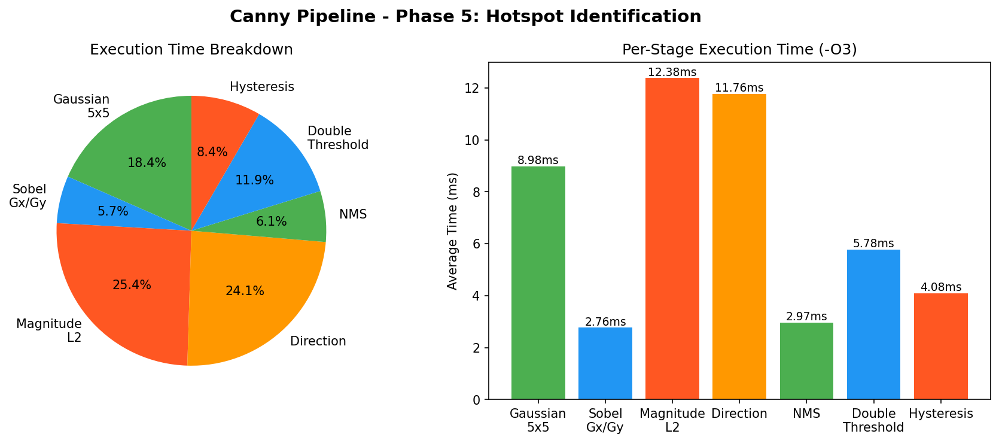

# Canny Edge Detection on RISC-V

This project implements a Canny Edge Detection pipeline in C++ and runs it on a RISC-V target using QEMU. The main purpose of the early project stages is to build a correct scalar baseline, verify each image-processing function, and prepare the codebase for later profiling and optimization.

The project reads a grayscale image, applies the Canny pipeline, and generates intermediate and final outputs that can be inspected as raw files or converted into PNG images.

---

## Project Objective

The objective of this project is to implement and validate a complete Canny Edge Detection pipeline for a RISC-V environment.

The project focuses on:

* Implementing Canny Edge Detection in C++.
* Cross-compiling the code for RISC-V.
* Running the RISC-V binary using QEMU.
* Reading a grayscale image as raw bytes from standard input.
* Generating intermediate outputs for debugging and visualization.
* Validating the main algorithmic stages using Google Test.
* Preparing a reliable scalar reference before entering the profiling and optimization phases.

---

## Canny Edge Detection Pipeline

The implemented pipeline follows these stages:

```text
Input Image
    ↓
Gaussian Blur
    ↓
Sobel / Gradient Stage
    ↓
Non-Maximum Suppression
    ↓
Double Threshold
    ↓
Hysteresis
    ↓
Final Edge Image
```

The scalar implementation is treated as the reference version. Any later optimized implementation should be compared against this scalar baseline.

---

## 1. Input Image Handling

The program expects a grayscale image represented as raw bytes.

The image dimensions are controlled by the Makefile variables:

```makefile
WIDTH  ?= 513
HEIGHT ?= 366
SIZE   := $(WIDTH)x$(HEIGHT)
```

The total number of pixels is:

```text
PIXELS = WIDTH × HEIGHT
```

For example:

```text
513 × 366 = 187758 pixels
```

The project can also be run with a different image size by overriding the variables:

```bash
make run IMG=tiger-animals-cat-predator-preview.jpg WIDTH=512 HEIGHT=512
```

---

## 2. Image Conversion

Normal image files such as JPG or PNG are converted to raw grayscale format using ImageMagick.

Example:

```bash
convert tiger-animals-cat-predator-preview.jpg -resize 512x512! -colorspace gray -depth 8 gray:-
```

This command performs the following operations:

| Part               | Meaning                                       |
| ------------------ | --------------------------------------------- |
| `-resize 512x512!` | Forces the image to exactly 512×512 pixels    |
| `-colorspace gray` | Converts the image to grayscale               |
| `-depth 8`         | Uses 8 bits per pixel                         |
| `gray:-`           | Writes raw grayscale bytes to standard output |

To verify that the converted image size is correct:

```bash
convert tiger-animals-cat-predator-preview.jpg -resize 512x512! -colorspace gray -depth 8 gray:- | wc -c
```

For a 512×512 image, the expected output is:

```text
262144
```

If the byte count does not match `WIDTH × HEIGHT`, the benchmark and generated output are invalid because the program is not processing the intended image data.

---

## 3. Gaussian Blur

Gaussian Blur is the first processing stage after reading the input image.

The purpose of Gaussian Blur is to reduce noise before edge detection. This helps avoid detecting false edges caused by small intensity variations.

The output of this stage is a smoothed version of the input image. This blurred image is then passed to the Sobel / Gradient stage.

---

## 4. Sobel / Gradient Stage

The Sobel / Gradient stage is responsible for computing edge strength and edge direction.

This stage contains four related sub-steps:

```text
Sobel / Gradient Stage
    ├── Gx calculation
    ├── Gy calculation
    ├── Magnitude calculation
    └── Direction quantization
```

---

### 4.1 Gx Calculation

`Gx` is the horizontal gradient.

It measures intensity changes in the horizontal direction and is useful for detecting vertical edges.

Because Sobel gradient values can be negative and can exceed the 8-bit range, `Gx` is stored using signed 16-bit integers.

---

### 4.2 Gy Calculation

`Gy` is the vertical gradient.

It measures intensity changes in the vertical direction and is useful for detecting horizontal edges.

Like `Gx`, `Gy` is stored using signed 16-bit integers.

---

### 4.3 Magnitude Calculation

The magnitude represents the edge strength at each pixel.

The project supports two magnitude forms:

```text
L1 magnitude = |Gx| + |Gy|
L2 magnitude = sqrt(Gx² + Gy²)
```

The L1 magnitude is simpler and faster because it uses only absolute value and addition.

The L2 magnitude is more accurate because it computes the Euclidean gradient magnitude.

The scalar Canny pipeline uses the L2 magnitude as the main magnitude input for the later stages.

---

### 4.4 Direction Quantization

The direction stage converts the gradient angle into one of four categories:

```text
0 = 0 degrees
1 = 45 degrees
2 = 90 degrees
3 = 135 degrees
```

This direction information is required by Non-Maximum Suppression. NMS needs to know which neighboring pixels should be compared with the current pixel.

---

## 5. Non-Maximum Suppression

Non-Maximum Suppression reduces thick edges into thinner edges.

For each pixel, the algorithm checks whether the current magnitude is a local maximum along the gradient direction.

If the current pixel is not the strongest value in that direction, it is suppressed.

The NMS stage uses:

```text
magnitude + direction
```

as its inputs.

---

## 6. Double Threshold

Double Threshold classifies pixels into three categories:

```text
255 = strong edge
128 = weak edge
0   = non-edge
```

The current thresholds are:

```text
low  = 10
high = 30
```

Strong edges are kept. Weak edges are temporarily kept and then processed by Hysteresis.

---

## 7. Hysteresis

Hysteresis is the final edge connection stage.

A weak edge is preserved only if it is connected to a strong edge. Otherwise, it is removed.

This stage produces the final edge image.

---

## Project Requirements

The project requires:

| Tool                      | Purpose                                                                                  |
| ------------------------- | ---------------------------------------------------------------------------------------- |
| `riscv64-unknown-elf-g++` | Cross-compiles the C++ code for RISC-V                                                   |
| `qemu-riscv64`            | Runs the RISC-V ELF binary on the host machine                                           |
| ImageMagick `convert`     | Converts normal images into raw grayscale input and converts raw outputs into PNG images |
| `make`                    | Automates build, test, run, and output-generation commands                               |
| `g++`                     | Builds native Google Test executables                                                    |
| Google Test               | Validates individual functions and stages                                                |

---

## Project Structure

```text
Canny-Edge-RISCV/
│
├── include/
│   ├── canny.hpp
│   ├── image_types.hpp
│   ├── nms.h
│   ├── double_threshold.h
│   ├── hysteresis.h
│   └── rvv_kernels.h
│
├── src/
│   ├── main.cpp
│   ├── canny.cpp
│   ├── nms.cpp
│   ├── double_threshold.cpp
│   ├── hysteresis.cpp
│   ├── direction_rvv.cpp
│   ├── magnitude_rvv.cpp
│   └── magnitude_l2_rvv.cpp
│
├── tests/
│   ├── test_canny.cpp
│   ├── test_nms.cpp
│   ├── test_double_threshold.cpp
│   └── test_hysteresis.cpp
│
├── scripts/
│   ├── compare_raw.py
│   └── compare_raw_outputs.py
│
├── build/
│   └── generated binaries
│
├── results/
│   └── generated images, logs, and comparison outputs
│
├── Makefile
└── README.md
```

The `include/` directory contains declarations and shared headers.

The `src/` directory contains the implementation of the Canny pipeline stages.

The `tests/` directory contains Google Test unit tests.

The `scripts/` directory contains raw-output comparison scripts.

The `build/` and `results/` directories are generated directories and should not be treated as source code.

---

## Makefile Variables

The Makefile provides several configurable variables:

| Variable         | Default                                  | Purpose                                                 |
| ---------------- | ---------------------------------------- | ------------------------------------------------------- |
| `CXX_RISCV`      | `riscv64-unknown-elf-g++`                | RISC-V cross-compiler                                   |
| `CXX_NATIVE`     | `g++`                                    | Native compiler used for Google Test                    |
| `IMG`            | `tiger-animals-cat-predator-preview.jpg` | Input image                                             |
| `WIDTH`          | `513`                                    | Image width                                             |
| `HEIGHT`         | `366`                                    | Image height                                            |
| `SIZE`           | `$(WIDTH)x$(HEIGHT)`                     | Image size passed to ImageMagick                        |
| `PIXELS`         | `WIDTH × HEIGHT`                         | Number of pixels used for raw output extraction         |
| `QEMU_LD_PREFIX` | `/usr/riscv64-linux-gnu`                 | QEMU library prefix                                     |
| `QEMU_CPU`       | `rv64,v=true,vlen=128`                   | QEMU CPU configuration                                  |
| `RVV_EXTRA_DEFS` | empty                                    | Optional extra compile-time definitions for experiments |

Example with custom image size:

```bash
make test_image IMG=tiger-animals-cat-predator-preview.jpg WIDTH=512 HEIGHT=512
```

---

## Makefile Commands

The Makefile is used to simplify building, testing, running, generating images, and preparing for later profiling and optimization.

### Build Commands

| Command              | What it does                                                                                                                       |
| -------------------- | ---------------------------------------------------------------------------------------------------------------------------------- |
| `make` or `make all` | Builds the default scalar RISC-V binary by calling `make riscv`                                                                    |
| `make riscv`         | Builds the main scalar RISC-V binary using `-O3` and outputs `build/canny_riscv.elf`                                               |
| `make riscv_O0`      | Builds a RISC-V binary using `-O0`                                                                                                 |
| `make riscv_O2`      | Builds a RISC-V binary using `-O2`                                                                                                 |
| `make riscv_O3`      | Builds a RISC-V binary using `-O3`                                                                                                 |
| `make riscv_autovec` | Builds an auto-vectorized binary using `-O3 -ftree-vectorize` and saves GCC vectorization information in `build/vector_report.txt` |
| `make sweep_build`   | Builds the `-O0`, `-O2`, `-O3`, and auto-vectorized binaries                                                                       |

---

### Google Test Commands

| Command       | What it does                              |
| ------------- | ----------------------------------------- |
| `make native` | Builds all native Google Test executables |
| `make test`   | Runs all Google Test executables          |

---

### Basic Commands

| Command                          | What it does                                                      |
| -------------------------------- | ----------------------------------------------------------------- |
| `make run`                       | Builds and runs the scalar RISC-V binary through QEMU             |
| `make clean`                     | Removes the `build/` directory                                    |
| `make clean_results`             | Removes generated results and temporary raw files                 |
| `make push NAME="..." MSG="..."` | Runs `git add .`, commits using `NAME: MSG`, and pushes to GitHub |

Note: `make push` should be used carefully because it runs `git add .`. Always check `git status` before using it to avoid committing generated files.

---

### Image Generation Commands

| Command                  | What it does                                                                                                |
| ------------------------ | ----------------------------------------------------------------------------------------------------------- |
| `make test_image`        | Runs the scalar RISC-V binary and generates main PNG outputs in `results/`                                  |
| `make stage_pngs`        | Runs the scalar RISC-V binary and generates organized stage-by-stage PNGs in `results/stages_WIDTHxHEIGHT/` |
| `make open_images`       | Opens the `results/` folder                                                                                 |
| `make open_stage_images` | Opens the stage-output folder                                                                               |

### Later Profiling and Optimization Commands

The following targets are included in the Makefile for later phases, but they are not part of the pre-Phase-4 scalar documentation results.

| Command            | What it does                                                                                              |
| ------------------ | --------------------------------------------------------------------------------------------------------- |
| `make sweep_run`   | Builds and runs the optimization sweep for `-O0`, `-O2`, `-O3`, and auto-vectorized binaries              |
| `make manual_rvv`  | Builds the manual RVV binary using `USE_MANUAL_RVV` and `USE_RVV_GAUSSIAN`                                |
| `make compare_rvv` | Runs scalar and manual RVV binaries on the same image and prints timing blocks                            |
| `make check_rvv`   | Runs scalar and RVV binaries, saves raw outputs, and compares them using `scripts/compare_raw_outputs.py` |
| `make vlen_sweep`  | Runs the manual RVV binary using VLEN values 128, 256, and 512 and checks output equivalence              |

These commands are used after the scalar baseline is validated.

---

## Google Test Validation

Google Test is used to validate the scalar implementation before profiling and optimization.

The goal is to verify each major function in isolation before relying on the full Canny pipeline.

The scalar implementation is the reference version for later correctness comparisons.

---

## Current Status Before Phase 4

Before Phase 4, the project includes:

* A complete scalar Canny Edge Detection pipeline.
* RISC-V cross-compilation support.
* QEMU execution support.
* ImageMagick-based image conversion.
* Raw output generation for each major stage.
* PNG generation for visual inspection.
* Google Test validation for the main scalar functions.
* Makefile automation for building, running, testing, and generating outputs.

At this stage, the scalar implementation is considered the trusted baseline. Phase 4 and later phases focus on profiling, hotspot identification, auto-vectorization analysis, manual RVV development, and scalar-versus-RVV correctness comparison.

---

## Notes

The input image must always be converted to the exact size specified by `WIDTH` and `HEIGHT`.

Generated folders such as `build/` and `results/` should not be treated as source files.

The scalar implementation should be verified before collecting performance measurements or comparing optimized versions.


# Phase 4: Compiler Optimization Sweep

## Objective

The objective of Phase 4 is to evaluate the effect of compiler optimization levels on the execution time and binary size of the Canny Edge Detection pipeline on a RISC-V target.

The tested optimization variants are:

* `-O0`
* `-O2`
* `-O3`
* Auto-vectorized build using `-O3 -ftree-vectorize -fopt-info-vec-all`

Each Canny stage is executed for 100 iterations, and the average execution time per stage is reported.

---

## Toolchain and Target

The project was compiled using the RISC-V bare-metal toolchain:

```bash
riscv64-unknown-elf-g++
```

The target architecture is:

```bash
-march=rv64gcv
```

The binaries were executed using:

```bash
qemu-riscv64 -cpu rv64,v=true,vlen=128
```

The same compiler, Makefile settings, and QEMU command should be used for all optimization variants to make the comparison fair.

---

## Timing Method

The profiling code uses wall-clock timing based on `CLOCK_MONOTONIC`.

Normally, Linux/POSIX programs use:

```cpp
clock_gettime(CLOCK_MONOTONIC, &ts);
```

However, this project uses the `riscv64-unknown-elf-g++` bare-metal toolchain, which does not expose the POSIX `clock_gettime()` function directly through the C library.

To keep the same project toolchain while still using monotonic wall-clock timing, the implementation invokes the RISC-V Linux `clock_gettime` syscall directly under `qemu-riscv64`.

The timing path is:

```text
now_ms() -> linux_clock_gettime(CLOCK_MONOTONIC, &ts) -> RISC-V Linux syscall -> monotonic wall-clock time
```

This means the project still uses `CLOCK_MONOTONIC` timing, but through the lower-level syscall interface instead of the normal C library wrapper.

Each stage is measured as:

cpp
start_time = now_ms();
/* run stage 100 times */
end_time = now_ms();
average_time = (end_time - start_time) / 100;


This satisfies the requirement of using monotonic wall-clock timing and averaging over 100 iterations.

---
## Execution Command

The sweep was run using:

make sweep_run IMG=tiger-animals-cat-predator-preview.jpg

The input image is converted to a 512×512 grayscale raw stream before being passed to the RISC-V executable.

---

## Important Note About Timing Differences

Even if two team members use the same repository commit, the same compiler, the same Makefile, and the same QEMU command, their absolute timing values may still differ.

This is because the program is executed through QEMU user-mode emulation, and the measured wall-clock time depends on the host machine. Factors such as CPU speed, WSL performance, system load, power mode, thermal throttling, RAM speed, and QEMU runtime behavior can affect the total measured time.

Therefore, Phase 4 comparisons should be made using one consistent environment. The most important result is the relative trend between `-O0`, `-O2`, `-O3`, and auto-vectorized builds within the same machine, not the direct comparison of absolute milliseconds between different laptops.

The results below were collected from one environment and should be interpreted as one consistent optimization sweep.

---

## Phase 4 Optimization Results

| Build           | Compiler Flags                            | Total Average Time per Iteration (ms) | Speedup vs `-O0` |
| --------------- | ----------------------------------------- | ------------------------------------: | ---------------: |
| `O0`            | `-O0`                                     |                               251     |            1.00× |
| `O2`            | `-O2`                                     |                                       |            4.86× |
| `O3`            | `-O3`                                     |                               49      |            5.03× |
| Auto-vectorized | `-O3 -ftree-vectorize -fopt-info-vec-all` |                                       |            5.01× |

---

## Stage Timing Breakdown


   here put timing for all build types for each function


## Binary Size Results

| Build           | Text Size (bytes) | Data Size (bytes) | BSS Size (bytes) | Total Size `dec` (bytes) |
| --------------- | ----------------: | ----------------: | ---------------: | -----------------------: |
| `O0`            |           608,907 |             4,150 |           12,088 |                  625,145 |
| `O2`            |           568,717 |             4,166 |           12,088 |                  584,971 |
| `O3`            |           571,135 |             4,166 |           12,088 |                  587,389 |
| Auto-vectorized |           571,135 |             4,166 |           12,088 |                  587,389 |

---

## Timing Verification

The timing implementation was verified by checking that all measured stages call `now_ms()`, and that `now_ms()` uses `CLOCK_MONOTONIC` through the direct RISC-V Linux `clock_gettime` syscall.

The important code path is:

```cpp
linux_clock_gettime(CLOCK_MONOTONIC, &ts);
```

Each measured stage uses:

```cpp
start_time = now_ms();
/* kernel loop */
end_time = now_ms();
```

This confirms that the Phase 4 timing sweep uses monotonic wall-clock timing instead of the normal `clock()` function. The only occurrence of `clock()` in the source file is inside a comment for explanation.

---

## Analysis

The `-O2`, `-O3`, and auto-vectorized builds greatly reduce the execution time compared to the unoptimized `-O0` build.

The `-O0` build has a total average runtime of 251 ms per iteration. After enabling compiler optimization, the runtime drops to approximately 40 ms per iteration.

The best runtime in this sweep is obtained by the `-O3` build:

```text
O3 total average time = 49 ms
```

compared to the `-O0` build.

The auto-vectorized build gives a very similar runtime to the normal `-O3` build:

```text
O3 total average time = 47 ms
Auto-vectorized total average time = 47.1 ms
```

This means that automatic vectorization did not provide a noticeable speedup over `-O3` in this run. The binary size of the `-O3` and auto-vectorized builds is also identical, suggesting that the compiler did not significantly change the generated code size for the auto-vectorized configuration.

The binary size decreases significantly from `-O0` to `-O2`, then slightly increases at `-O3`. This is expected because higher optimization levels may introduce additional optimized code transformations that slightly increase code size while improving runtime.

---

## Conclusion

Phase 4 shows that compiler optimization has a major effect on the Canny Edge Detection runtime. The optimized builds reduce the total execution time by about 5× compared to the unoptimized build.

The `-O3` build provides the best measured runtime in this sweep, while the auto-vectorized build performs almost the same as `-O3`. Therefore, further performance improvement may require manual RVV intrinsic optimization instead of relying only on automatic compiler vectorization.

Because the measured values are wall-clock times under QEMU, absolute timing values may differ between team members even with the same compiler and repository version. For this reason, all final Phase 4 comparisons should be taken from one consistent machine and environment.


## Phase 5: Hotspot Identification

### Best Binary: -O3 (49.17 ms/iteration)

| Stage        | Time (ms) | % of Total | RVV Target? |
|--------------|-----------|------------|-------------|
| Magnitude    | 12.37     | 25.2%      | ✅ YES      |
| Direction    | 11.96     | 24.3%      | ✅ YES      |
| Gaussian 5x5 | 8.97      | 18.2%      | ✅ YES      |
| D.Threshold  | 5.82      | 11.8%      | ❌ NO       |
| Hysteresis   | 4.32      | 8.8%       | ❌ NO       |
| NMS          | 2.96      | 6.0%       | ❌ NO       |
| Sobel Gx/Gy  | 2.77      | 5.6%       | ❌ NO       |



### Key Observations:
1. -O3 gives 5x speedup over -O0 (251ms → 49ms)
2. Direction stage REGRESSED at -O3 (3.4ms → 11.9ms) 
   due to branch-heavy conditional logic interfering with 
   loop unrolling — Amdahl's Law in practice
3. Auto-vectorization adds no benefit here (-O3 ≈ autovec)
   because GCC's cost model rejects most loops
4. Top 3 hotspots (Magnitude+Direction+Gaussian) = 67% 
   of runtime → these are the RVV targets for Phase 6


## Phase 6: Manual RVV Optimization Results

## Optimization Table

Image size:

```text
513 × 366 = 187,758 pixels
```

| Stage            | Scalar `-O3` | RVV 128    | RVV 256    |
| ---------------- | ------------ | ---------- | ---------- |
| Gaussian 5×5     | 6.58335 ms   | 45.2515 ms | 39.6791 ms |
| Sobel Gx/Gy      | 5.02564 ms   | 5.03673 ms | 5.04368 ms |
| Magnitude L2     | 9.38616 ms   | 8.97176 ms | 9.11594 ms |
| Direction        | 9.64107 ms   | 5.69558 ms | 4.89872 ms |
| NMS              | 2.27283 ms   | 2.22251 ms | 2.22604 ms |
| Double Threshold | 4.371 ms     | 4.23765 ms | 3.37642 ms |
| Hysteresis       | 3.33265 ms   | 3.27503 ms | 3.15699 ms |
| Total Average    | 40.6127 ms   | 74.6908 ms | 67.4969 ms |

Note: L1 magnitude is measured separately but excluded from the total average percentage because the main Canny pipeline continues using L2 magnitude for NMS.

---

## Additional L1 Magnitude Timing

| Stage        | Scalar `-O3` | RVV 128    | RVV 256    |
| ------------ | ------------ | ---------- | ---------- |
| Magnitude L1 | 7.45007 ms   | 6.92262 ms | 6.34042 ms |

L1 showed a small improvement with RVV because it mainly uses absolute value, addition, reduction, and normalization.

---

## Main Observations

The RVV direction kernel improved clearly:

```text
Scalar Direction: 9.64107 ms
RVV 128 Direction: 5.69558 ms
RVV 256 Direction: 4.89872 ms
```

L1 and L2 magnitude also showed small improvements.

However, the total RVV runtime became slower because the RVV Gaussian stage became much slower under QEMU:

```text
Scalar Gaussian: 6.58335 ms
RVV 128 Gaussian: 45.2515 ms
RVV 256 Gaussian: 39.6791 ms
```

This made Gaussian the dominant bottleneck in the manual RVV version.

---

## Why RVV Was Slower Under QEMU

The slowdown does not mean RVV is wrong. The main reason is that the project is running under QEMU, not on real RVV hardware.

On real RVV hardware, one vector instruction can process multiple elements in parallel. Under QEMU, RVV instructions are emulated in software, so each vector instruction adds decoding and simulation overhead.

The RVV version may also include extra overhead from:

* `vsetvl` inside vector loops
* vector load/store emulation
* mask and merge operations
* widening arithmetic
* reduction and normalization
* Gaussian 5×5 neighborhood memory accesses

The Gaussian RVV kernel is especially expensive under QEMU because each output pixel depends on a 5×5 neighborhood, requiring many vector loads and arithmetic operations.

Therefore, QEMU is useful for correctness and portability validation, but it is not always reliable for real RVV performance conclusions.

---

Increasing VLEN reduced runtime because more elements can be processed per vector iteration. However, even at VLEN 512, the RVV version was still slower than scalar because Gaussian remained expensive under QEMU.

---

## VLEN-Agnostic Correctness

The VLEN sweep compared outputs for VLEN 128, 256, and 512.

All stages matched exactly:

This confirms that the RVV implementation is VLEN-agnostic. Changing VLEN changes how many elements are processed per vector iteration, but it does not change the final output.

---

## Conclusion

Phase 6 successfully added manual RVV kernels and verified correctness across different VLEN values.

The main conclusions are:

* Direction RVV achieved clear speed improvement.
* L1 and L2 magnitude showed small improvements.
* Gaussian RVV became slower under QEMU and dominated total runtime.
* Total RVV runtime was slower than scalar because of QEMU vector emulation overhead.
* VLEN sweep confirmed exact output equivalence across VLEN 128, 256, and 512.

Overall, the manual RVV implementation is functionally correct and VLEN-agnostic, but the measured QEMU runtime should not be treated as final real-hardware RVV performance.


